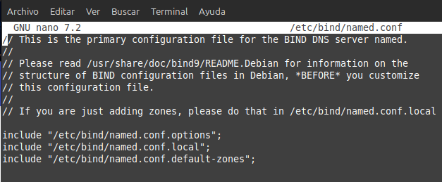
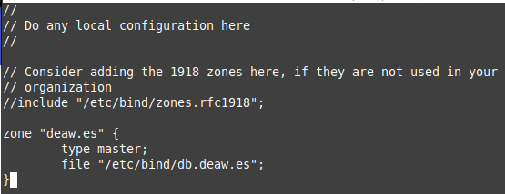
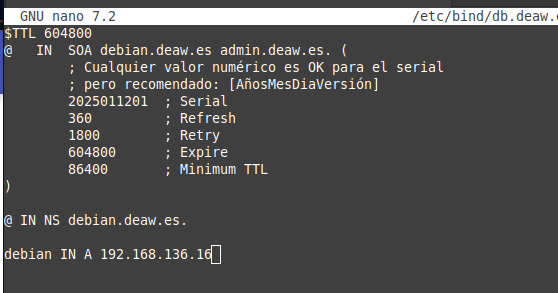
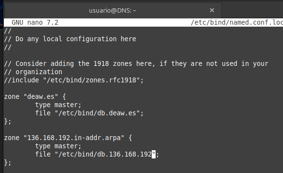
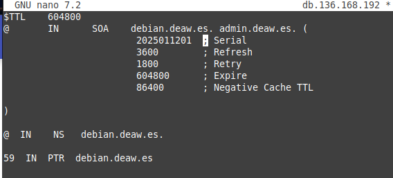
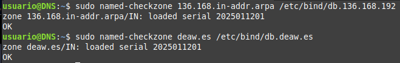
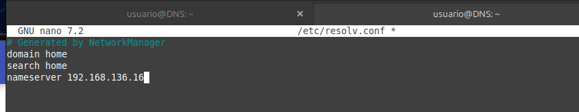
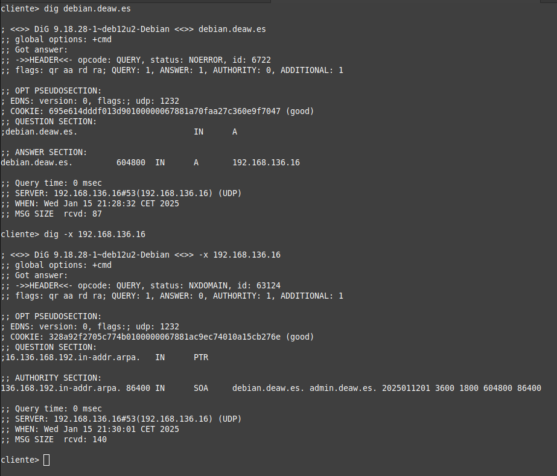

# Practica 4.1: Configuración De Un Servidor DNS

Como siempre lo primero que debemos de hacer conectarnos por ssh a nuestra máquina virtual.

## Instalación del DNS

Para empezar instalaremos el servidor DNS en nuestra máquina virtual.

## Configuración del servidor

Para ello debemos de modificar el archivo named alojado en la carpeta /etc/default y
nos aseguraremos que tenga la siguiente configuración:

Después veremos que el archivo /etc/bind/named.conf tenga la siguiente configuración:

Los tres archivos que aparecen ahí son los que después vamos a configurar.

### Configuración de named.conf.options

Hice una copia de seguridad del archivo por si acaso antes de empezar a modificarlo.

Ahora debemos de dejar el archivo named.conf.options de esta forma:

- allow-recursion {confiables;}; es para que los clientes puedan hacer consultas recursivas.

- allow-transfer {none;}; es para que no se puedan hacer transferencias de zona.

- listen-on port 53 {192.168.136.16;}; es para que el servidor escuche en la dirección IP de la máquina.

- recursion yes; Permite hacer consultas recursivas.

- dnssec-validation yes; Habilita la validación de DNSSEC.

- dnssec-enable yes; está deprecated, de forma que lo comenté ya que al comprobar la configuración me daba error.

Una vez hecho comprobamos la configuración con el comando sudo named-checkconf.

Dado que no ha salido nada quiere decir que está todo correcto.Por último reiniciamos el servicio con el comando sudo systemctl restart named.

### Configuración de named.conf.local

Debemos de modificar el archivo named.conf.local para que quede de la siguiente forma:

### Configuración de las zonas directa e inversa

Primero debemos de crear los archivos de las zonas directa e inversa.

para la zona directa. Para la zona inversa hay que añadir unas lineas en el archivo /etc/bind/named.conf.local.

Acto seguido se crea el archivo de la zona inversa.

comprobamos que la configuración es correcta con el comando sudo named-checkzone.

Por último reiniciamos el servicio con el comando sudo systemctl restart named.

## Comprobaciones de las configuraciones

Antes de nada debemos de configurar la máquina cliente para que pueda hacer consultas al servidor DNS.Para ello
debemos de modificar el archivo /etc/resolv.conf y añadir la dirección IP del servidor DNS.

## Comprobación de la resolución de nombres y consultas

Ahora debemos de comprobar que la resolución de nombres funciona correctamente usando dig.

Por último comprobamos mediante nslookup.

## Cuestiones finales

1. ¿Qué pasará si un cliente de una red diferente a la tuya intenta hacer uso de tu DNS de alguna manera, le funcionará?¿Por qué, en qué parte de la configuración puede verse?

No funcionará, ya que en la configuración se ha restringido la recursión solo a los clientes confiables con la directiva: allow-recursion {confiables;}; 
Esto significa que solo las direcciones IP definidas en "confiables" podrán realizar consultas recursivas. 
Si un cliente externo intenta resolver un dominio usando este DNS, su petición será rechazada.

2. ¿Por qué tenemos que permitir las consultas recursivas en la configuración?

Para que los clientes puedan hacer consultas recursivas. Si no se permiten consultas recursivas, el servidor DNS solo responderá a las consultas de las 
zonas que administra y no podrá resolver dominios externos.

3. El servidor DNS que acabáis de montar, ¿es autoritativo?¿Por qué?

Sí, es autoritativo porque tiene la información de las zonas directa e inversa que administra y puede responder a las consultas de esas zonas.

4. ¿Dónde podemos encontrar la directiva $ORIGIN y para qué sirve?

La directiva $ORIGIN se encuentra en los archivos de zona y establece el dominio base para los registros.

5. ¿Una zona es idéntico a un dominio?

No, un dominio es un subarbol del espacio de nombres de dominio.
Una zona es una parte de un dominio gestionada por un servidor DNS específico.

1. ¿Pueden editarse los archivos de zona de un servidor esclavo/secundario?

No, los servidores secundarios obtienen los datos de un servidor maestro mediante transferencias de zona.

7. ¿Por qué podría querer tener más de un servidor esclavo para una misma zona?

Para mejorar la redundancia y la disponibilidad. Si un servidor secundario falla, 
los otros servidores secundarios pueden seguir respondiendo a las consultas.

8. ¿Cuántos servidores raíz existen?

Hay 13 servidores raíz de la A a la M.

9. ¿Qué es una consulta iterativa de referencia?

Una consulta iterativa de referencia es una consulta en la que el servidor DNS no responde con la dirección IP del dominio solicitado,
sino que responde con la dirección IP de un servidor DNS que puede proporcionar más información sobre el dominio solicitado.

1.  En una resolución inversa, ¿a qué nombre se mapearía la dirección IP 172.16.34.56?

56 IN PTR nombre_host.
