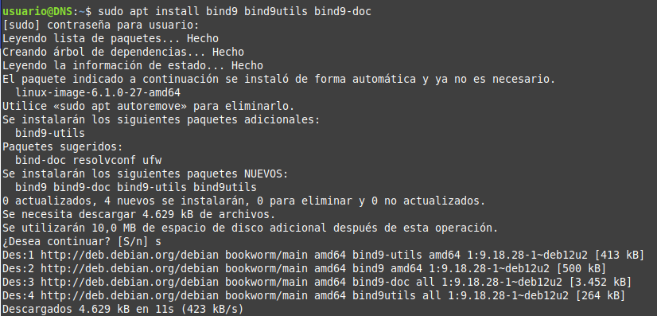
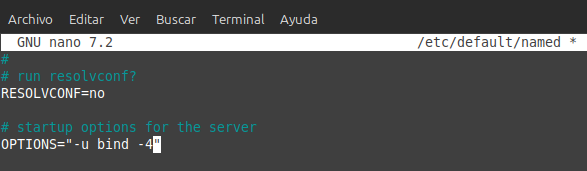
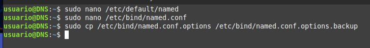
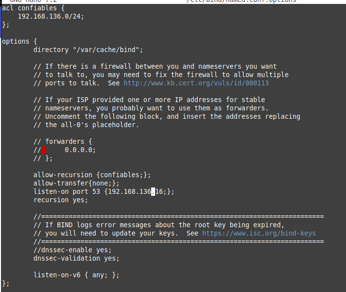
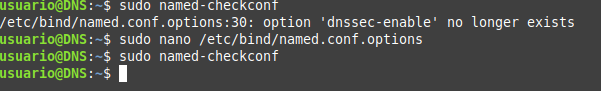
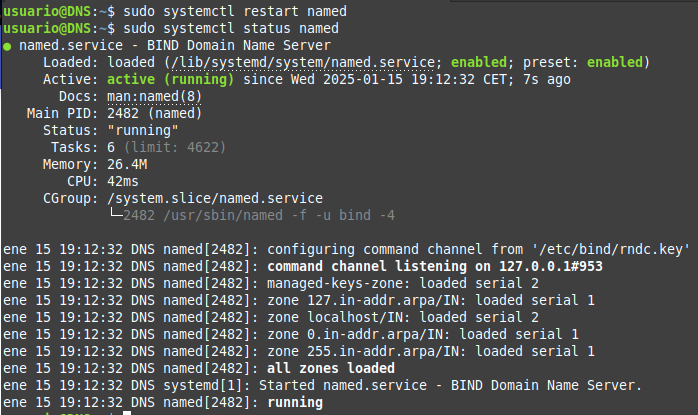

# Practica 4.1: Configuración De Un Servidor DNS

Como siempre lo primero que debemos de hacer conectarnos por ssh a nuestra máquina virtual.

## Instalación del DNS

Para empezar instalaremos el servidor DNS en nuestra máquina virtual.

## Configuración del servidor

Para ello debemos de modificar el archivo named alojado en la carpeta /etc/default y
nos aseguraremos que tenga la siguiente configuración:

Después veremos que el archivo /etc/bind/named.conf tenga la siguiente configuración:

Los tres archivos que aparecen ahí son los que después vamos a configurar.

### Configuración de named.conf.options

Hice una copia de seguridad del archivo por si acaso antes de empezar a modificarlo.

Ahora debemos de dejar el archivo named.conf.options de esta forma:

- allow-recursion {confiables;}; es para que los clientes puedan hacer consultas recursivas.

- allow-transfer {none;}; es para que no se puedan hacer transferencias de zona.

- listen-on port 53 {192.168.136.16;}; es para que el servidor escuche en la dirección IP de la máquina.

- recursion yes; Permite hacer consultas recursivas.

- dnssec-validation yes; Habilita la validación de DNSSEC.

- dnssec-enable yes; está deprecated, de forma que lo comenté ya que al comprobar la configuración me daba error.

Una vez hecho comprobamos la configuración con el comando sudo named-checkconf.

Dado que no ha salido nada quiere decir que está todo correcto.Por último reiniciamos el servicio con el comando sudo systemctl restart named.

### Configuración de named.conf.local

### Configuración de las zonas directa e inversa

## Comprobaciones de las configuraciones

## Comprobación de la resolución de nombres y consultas

## Cuestiones finales
